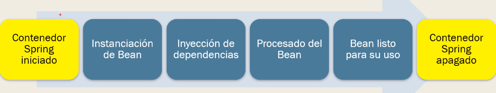
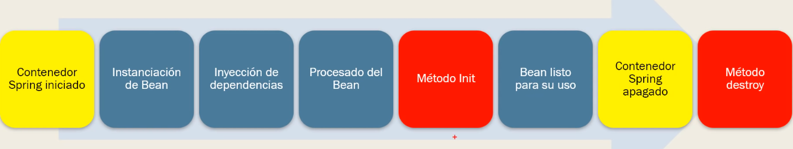

# Ciclo de Vida de un Bean

---

Los bean tienen un ciclo de vida y nos permiten ejecutar tareas tanto como antes de su creación o después de su creación.

Sin embargo surge la necesidad de realizar tareas antes y despues de su uso

Haremos una modificaciones para realizar unos ejemplos.

## Clase DirectorEmpleado

    package com.JarodSmith.IoC;

    public class DirectorEmpleado implements Empleados {
    
        //CREACION DE CAMPO TIPO CREACIONINFORME (INTERFAZ)
        private CreacionInformes informeNuevo;
    
        private String email;
        private String nombreEmpresa;
    
        //CREACIÓN DE CONSTRUCTOR QUE INYECTA LA DEPENDENCIA
        public DirectorEmpleado(CreacionInformes informeNuevo) {
            this.informeNuevo = informeNuevo;
        }
    
        //Método Init. Ejecutar tareas antes de que el bean esté disponible
        public void metodoInicial() {
            //TAREAS A EJECUTAR
            System.out.println("Ejecutando método Inicial. acá van todas las tareas a ejecutar antes de que el bean esté disponible");
        }
    
        //Método Destroy. Ejecutar tareas después de que el bean haya sido utlizado
        public void metodoFinal() {
            //TAREAS A EJECUTAR
            System.out.println("Ejecutando método Final.  Acá van todas la tareas a ejecutar después de utilizar el bean.");
        }

        public String getEmail() {
            return email;
        }

        public void setEmail(String email) {
            this.email = email;
        }

        public String getNombreEmpresa() {
            return nombreEmpresa;
        }

        public void setNombreEmpresa(String nombreEmpresa) {
            this.nombreEmpresa = nombreEmpresa;
        }

        @Override
        public String getTareas() {
            return "[Director] Gestiono la plantilla de la empresa.";
        }

        @Override
        public String getInforme() {
            return "[Director] Informe creado por el Director " + informeNuevo.getInforme();
        }

    }

## applicationContext3.xml

    <?xml version="1.0" encoding="UTF-8"?>
    <beans xmlns="http://www.springframework.org/schema/beans"
        xmlns:xsi="http://www.w3.org/2001/XMLSchema-instance"
        xmlns:context="http://www.springframework.org/schema/context"
        xsi:schemaLocation="
        http://www.springframework.org/schema/beans   
        http://www.springframework.org/schema/beans/spring-beans-3.1.xsd
        http://www.springframework.org/schema/context 
        http://www.springframework.org/schema/context/spring-context-3.1.xsd
            ">
    
        <!-- CREACION DE LA DEPENDENCIA -->     
        <bean id="miInforme" class="com.JarodSmith.IoC.Informe"></bean> 
    
        <!-- BEAN QUE GENERA LA INYECCION CON CONSTRUCTOR -->
        <bean id="miDirectorEmpleado" class="com.JarodSmith.IoC.DirectorEmpleado"
        init-method="metodoInicial" destroy-method="metodoFinal">
    
            <!-- CONFIGURAR EL USO DE LA DEPENDENCIA -->
            <constructor-arg ref="miInforme"></constructor-arg>

        </bean>

    </beans>

## Clase Principal

    package com.JarodSmith.IoC;

    import org.springframework.context.support.ClassPathXmlApplicationContext;

    public class UsoCicloVidaBean {

        public static void main(String[] args) {
            //CARGAR XML DE CONFIGURACION
            ClassPathXmlApplicationContext contexto = new ClassPathXmlApplicationContext("applicationContext3.xml");
    
            //OBTENER EL BEAN
            Empleados juan = contexto.getBean("miDirectorEmpleado", Empleados.class);
    
            System.out.println(juan.getInforme());
    
            //CERRAR EL CONTEXTO
            contexto.close();
    
            /*OUTPUT
            Ejecutando método Inicial. acá van todas las tareas a ejecutar antes de que el bean esté disponible
            [Director] Informe creado por el Director [Informe] Esta es la presentación del Informe.
            Ejecutando método Final.  Acá van todas la tareas a ejecutar después de utilizar el bean. 
             **/
        }
    }
