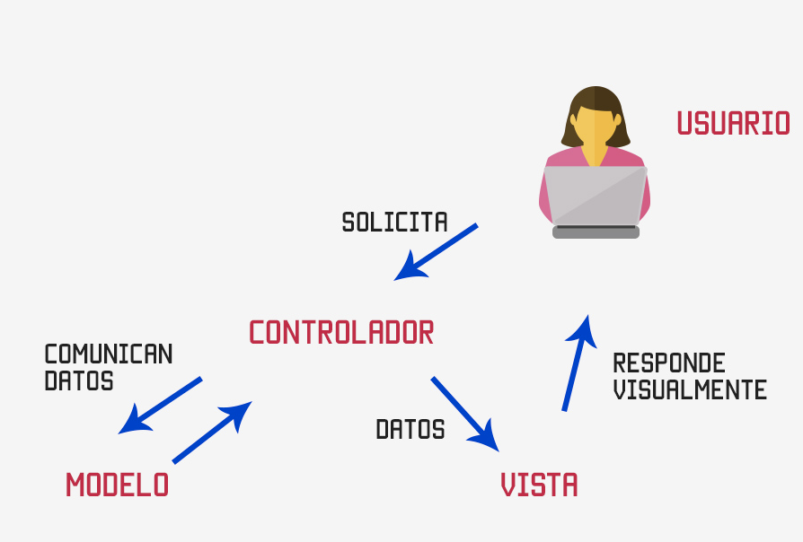

# Web Application I: Modelo Vista Controlador

---

## Modelo Vista Controlador

El patrón de diseño Modelo Vista Controlador (MVC) es un patrón de arquitectura de software que separa los datos y la lógica de negocio de una aplicación de la interfaz de usuario y el módulo encargado de gestionar los eventos y las comunicaciones. Para ello, MVC propone dividir una aplicación en tres componentes:

- **Modelo**: Representa la información con la que trabaja la aplicación, así como las reglas de negocio que gobiernan el acceso y actualización de dicha información. *(JavaBeans, POJOs, Base de datos, etc.)*
- **Vista**: Representa la interfaz de usuario, es decir, la forma en que los datos son presentados al usuario. *(HTML, JSP, etc.)*
- **Controlador**: Se encarga de recibir las peticiones del usuario, procesarlas y enviar una respuesta adecuada. *(Servlets)*

### Ventajas

- **Separación de responsabilidades**: Cada componente tiene una responsabilidad clara y bien definida.
- **Reutilización de código**: Al separar la lógica de negocio de la interfaz de usuario, es posible reutilizar los componentes en diferentes contextos.
- **Facilidad de mantenimiento**: Al tener una estructura clara y bien definida, es más fácil realizar cambios y correcciones en la aplicación.
- **Facilidad de pruebas**: Al separar la lógica de negocio de la interfaz de usuario, es más sencillo realizar pruebas unitarias y de integración.
- **Escalabilidad**: Al tener una estructura modular, es más sencillo escalar la aplicación añadiendo nuevos componentes.
