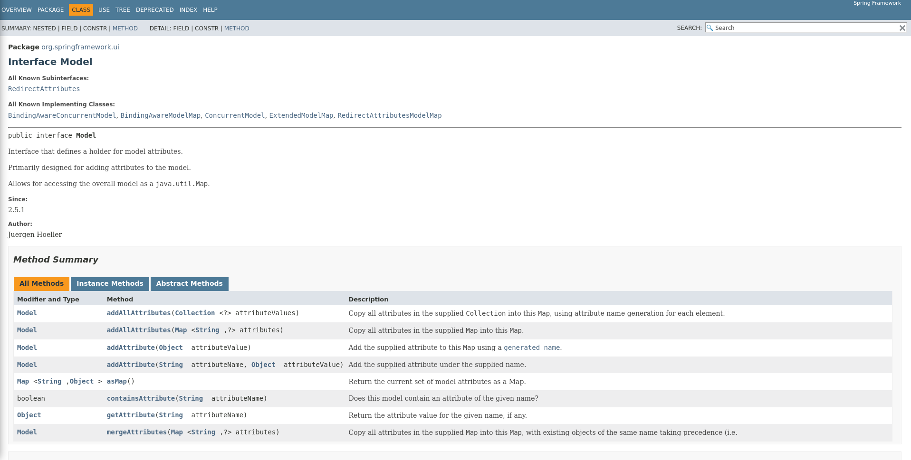

# Web Application: Agrega datos al Modelo

---

El modelo puede tener datos de:

- Información de BBDD
- Objetos de Java
- Colecciones
- etc.

Para agregar datos al modelo debemos usar la intefaz `Model` y esa intefaz cuenta con un método sobrecargado llamado `addAttribute()`

Enlace a la documentación oficial de Spring [https://docs.spring.io/spring-framework/docs/current/javadoc-api/index.html](https://docs.spring.io/spring-framework/docs/current/javadoc-api/index.html)

Si revisamos en la API de Spring [y filtramos por "Model"](https://docs.spring.io/spring-framework/docs/current/javadoc-api/org/springframework/ui/Model.html) podemos revisar lo siguiente:



## Clase HolaAlumnosControlador

```java
package com.JarodSmith.spring.mvc;


import javax.servlet.http.HttpServletRequest;
import org.springframework.stereotype.Controller;
import org.springframework.ui.Model;
import org.springframework.web.bind.annotation.RequestMapping;

@Controller
public class HolaAlumnosControlador {

    //MÉTODO PROPORCIONA EL FORMULARIO A LA VISTA
    @RequestMapping("/muestraFormulario")
    public String muestraFormulario() {
        return "HolaAlumnosFormulario";
    }

    //MÉTODO QUE PROCESE EL FORMULARIO Y RETORNE UNA RESPUESTA
    @RequestMapping("/procesarFormulario")
    public String procesarFormulario() {
        return "HolaAlumnosSpring";
    }

    //AGREGAR INFORMACION A NUESTRO MODELO
    @RequestMapping("/procesarFormulario2")
    public String otroProcesoFormulario(HttpServletRequest request, Model modelo) {
        //CAPTURAR INFORMACION QUE VIENE DESDE EL FORMULARIO (VISTA)
        String nombre = request.getParameter("nombreAlumno");

        //Manipulación del valor capturado
        nombre += " es el mejor alumno";

        //Agrega información extra
        String mensajeFinal = "¿Quién es el mejor alumno? " + nombre;

        //AGREGAR DATOS AL MODELO
        modelo.addAttribute("mensaje", mensajeFinal);

        //DEVOLVER LA VISTA
        return "HolaAlumnosSpring";
    }
}
```

## JSP HolaAlumnosFormulario

```HTML
<%@ page language="java" contentType="text/html; charset=UTF-8"
        pageEncoding="UTF-8"%>
    <!DOCTYPE html>
    <html>
        <head>
            <meta charset="UTF-8">
            <title>Envío</title>
        </head>
        <body>
            <header>
                <nav></nav>
            </header>
    
            <main>
                <h1>Formulario</h1>
    
                <!-- ACTION DEBE APUNTAR A LA RUTA QUE ESTÁ DEFINIDA EN EL CONTROLADOR -->
                <form action="procesarFormulario2" method="GET">
                    <input type="text" name = "nombreAlumno" placeholder="Ingrese su nombre" />
                    <input type="submit" value="Enviar" />
                </form>
            </main>
    
        </body>

        <footer>
        </footer>
    </html>
```

## JSP HolaAlumnosSpring

```HTML
<%@ page language="java" contentType="text/html; charset=UTF-8"
        pageEncoding="UTF-8"%>
    <!DOCTYPE html>
    <html>
        <head>
            <meta charset="UTF-8">
        <title>Respuesta</title>
        </head>
        <body>
            <header>
                <nav></nav>
            </header>
    
            <main>
                <h1>Página de respuesta</h1>
                <p>Hola ${param.nombreAlumno}.  Bienvenido al curso de Spring.</p>
    
                <h2>Atención a todos.</h2>
    
                <!-- RESCATAR INFORMACION DEL MODELO -->
                <p>${mensaje}</p>
    
            </main>
        </body>
    </html>
```
