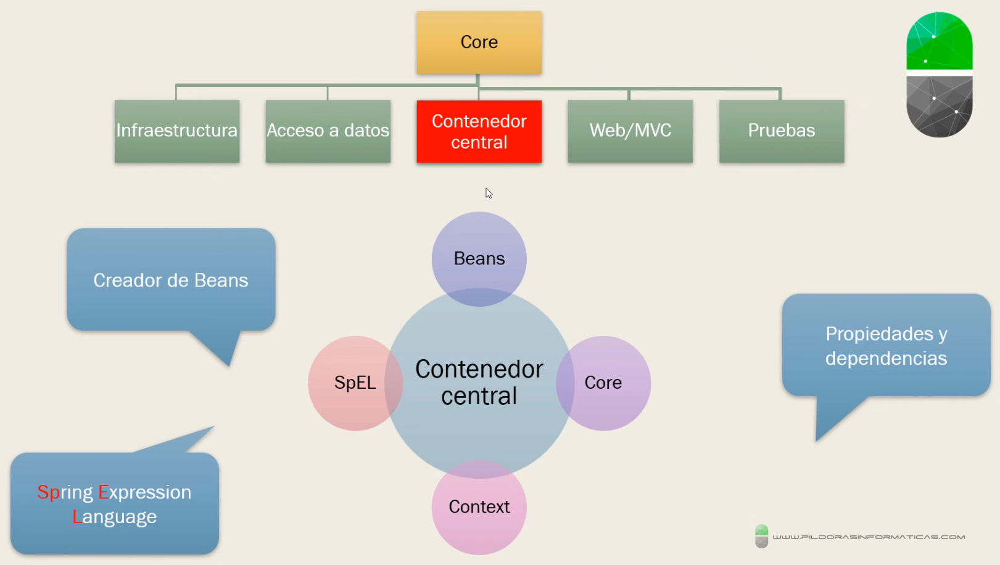
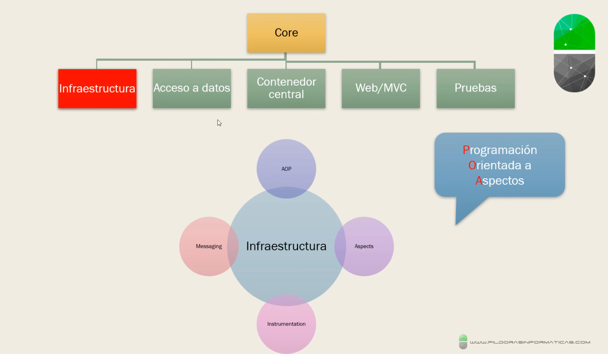
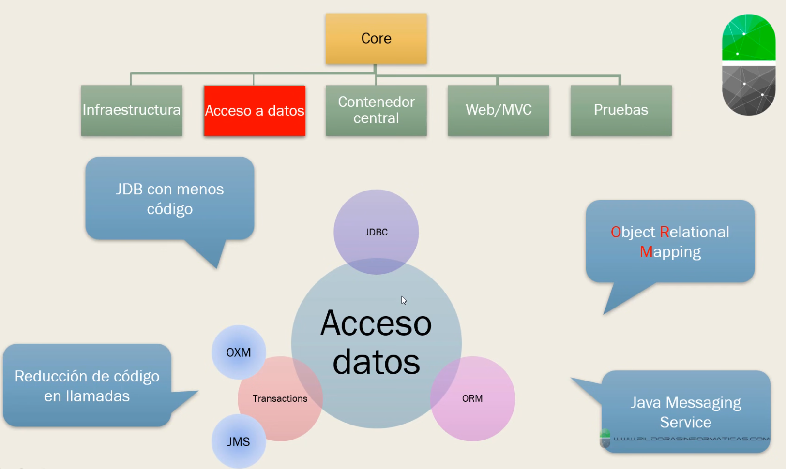
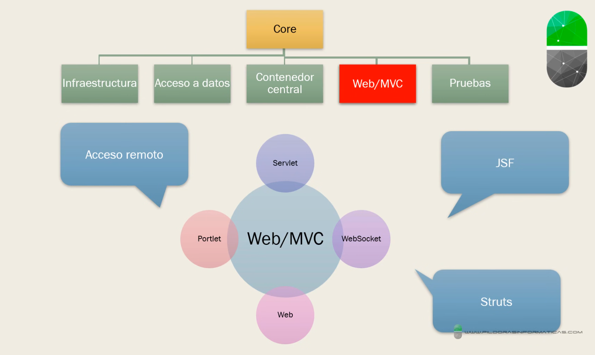
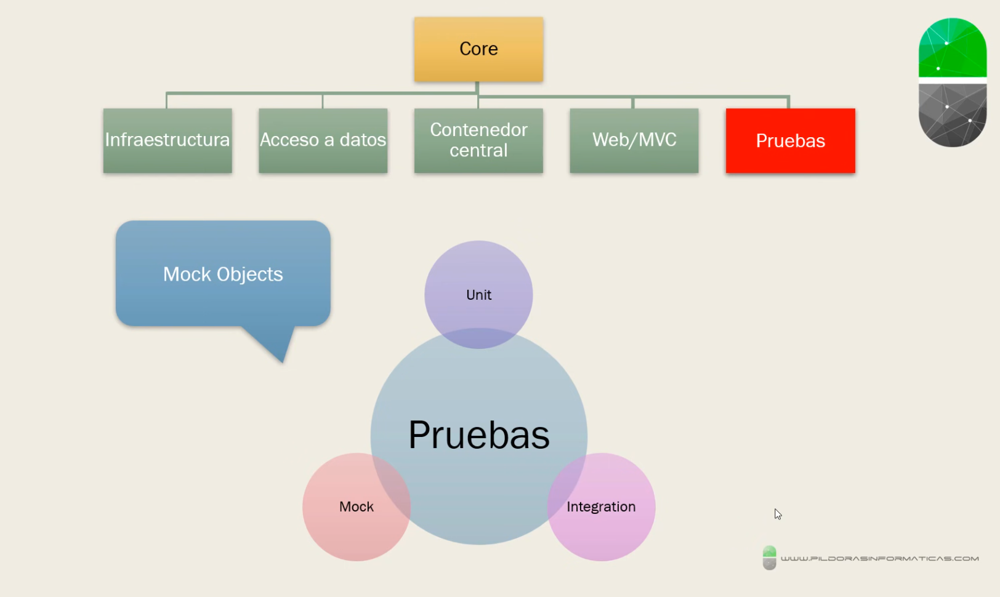

# Ventajas de Spring

---

### Inyección de dependencias (favorece el "loose Coupling")

La inyección de dependencias, Permite la separación de los modulos para todas las modificaciones las debas hacer en un lugar en concreto y no repetir aquella modificación.

### Desarrollo sencillo con POJOs (Plain Old Java Objects)

Es una clase sencilla, sin herencia, sin implementar interfaz

### Minimiza el código repetitivo (Boilerplate code)

Es parecido al loose Coupling, reduce el codigo repetitivo.

### Simplifica el acceso a datos

### Programación Orientada a Aspectos (AOP)

Permite una modularización muy alta

## Core de Spring

### Contenedor Central

### Infraestructura

### Acceso a datos

### Web/MVC

### Pruebas (Testing)

