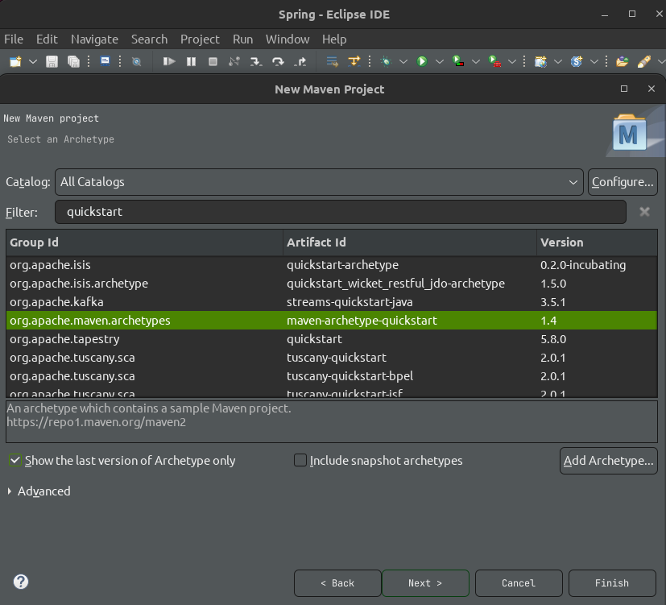
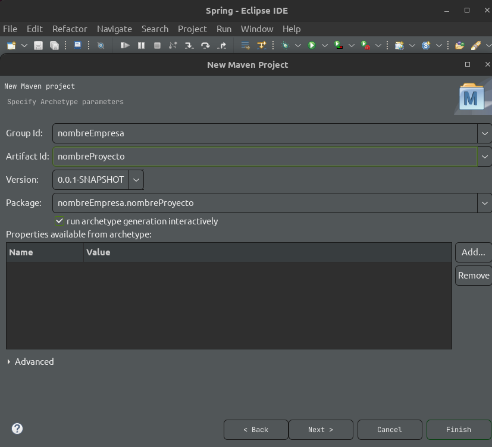
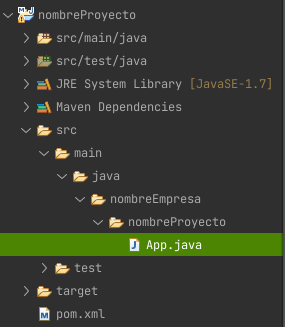
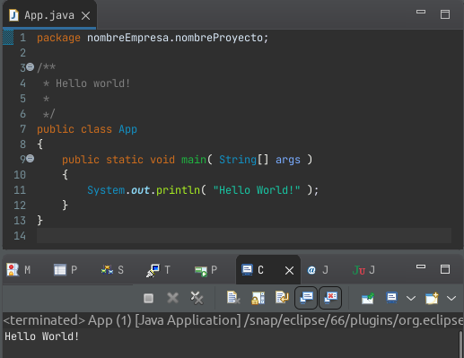

# Maven II

---

## Maven Archetypes

Son plantillas para crear proyectos Maven, son utilizados para:

- Proyectos Web
- Proyectos Java
- Etc.

Se pueden utilizar estos archetypes desde línea de comandos, sin embargo como los IDE's ya soportan Maven, podemos utilizarlos desde allí.

### Crear proyecto Maven Eclipse

File > Other > Maven > Maven Project

Utilizaremos el siguiente Archetype

`<GroupId>org.apache.maven.archetypes</GroupId>`
`<ArtifactId>maven-archetype-quickstart</ArtifactId>`
`<version>1.4</version>`

para eso lo buscaremos usando en el filtro la palabra: `quickstart`

Ahora debemos configurar GAV

Una vez finalizado la estructura será así:

Podemos ejecutar el proyecto Java y obtendremos el clásico "Hello World!"

