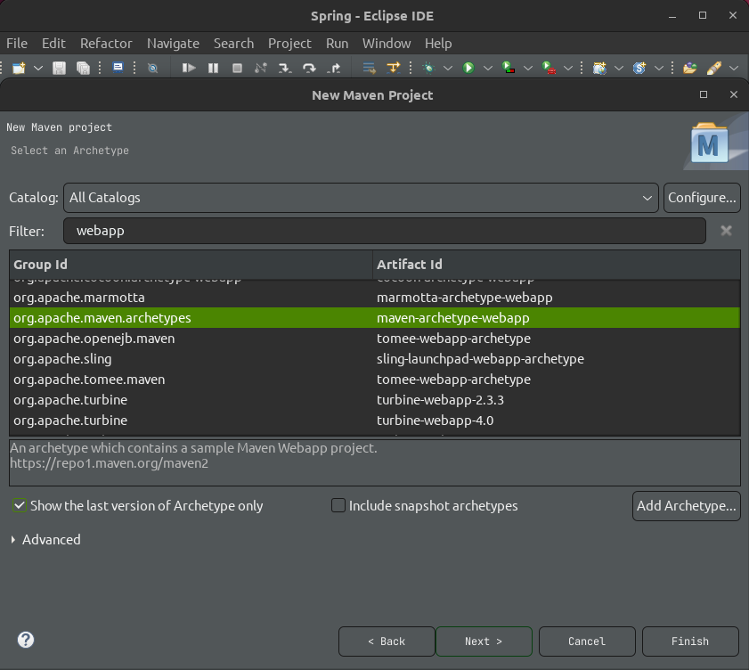
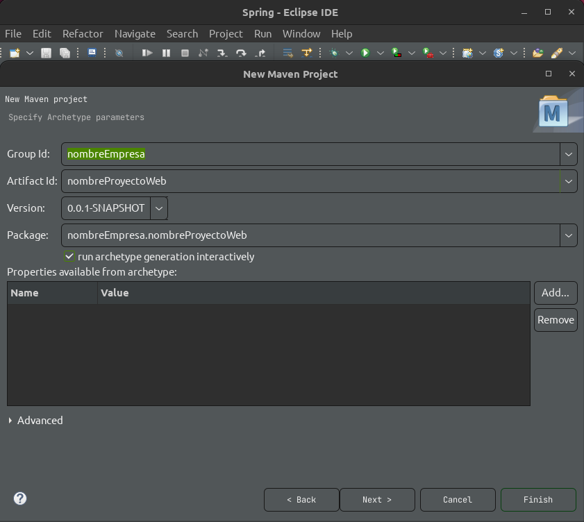
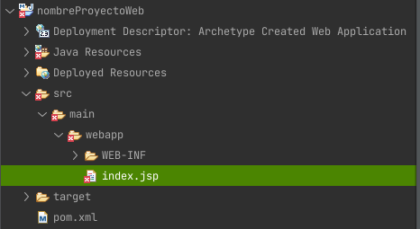
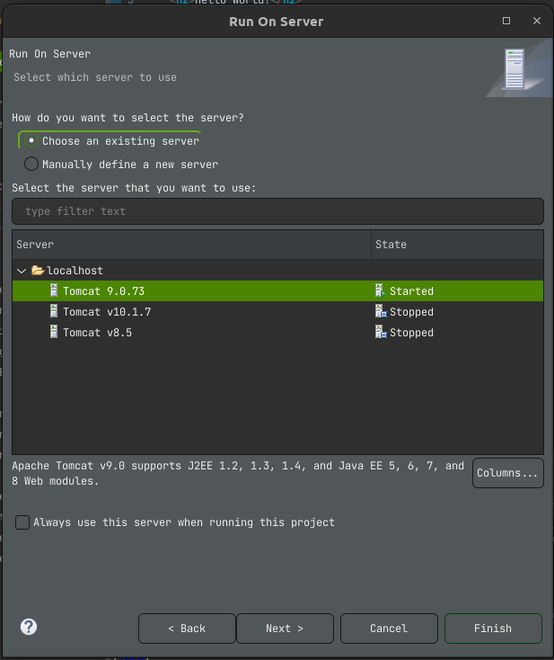
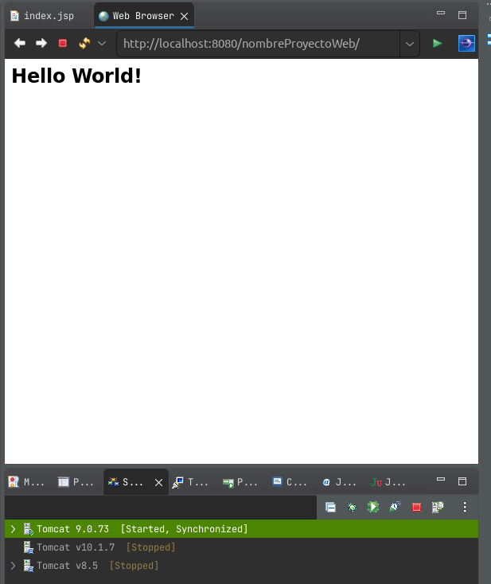

# Maven III

---

## Creación de un proyecto Web con Maven

File > Other > Maven > Maven Proyect

Usaremos el siguiente archetype

`<GroupId>org.apache.maven.archetypes</GroupId>`
`<ArtifactId>maven-archetype-webapp</ArtifactId>`
`<version>1.4</version>`

para eso filtraremos por la palabra `webapp`

Ahora configuraremos el GAV

La Estructura del proyecto será esta: 

Ejecutar el proyecto con un servidor en este caso lo haremos con Tomcat v9.0.73

Abrir el navegador en el puerto configurado por tomcat en este caso 8080

Como curiosidad el arhivo index.jsp tiene un "error", al revisarlo indica "The superclass javax.servlet.http.HttpServlet was not found" esto se soluciona agregando la dependencia faltante el el `pom.xml`, lo cual haremos agregando las siguientes líneas.

    <dependency>
    	<groupId>javax.servlet</groupId>
    	<artifactId>javax.servlet-api</artifactId>
    	<version>4.0.1</version>
	</dependency>

Luego debemos actualizar el proyecto Maven para que aplique el cambio recientemente agregado.